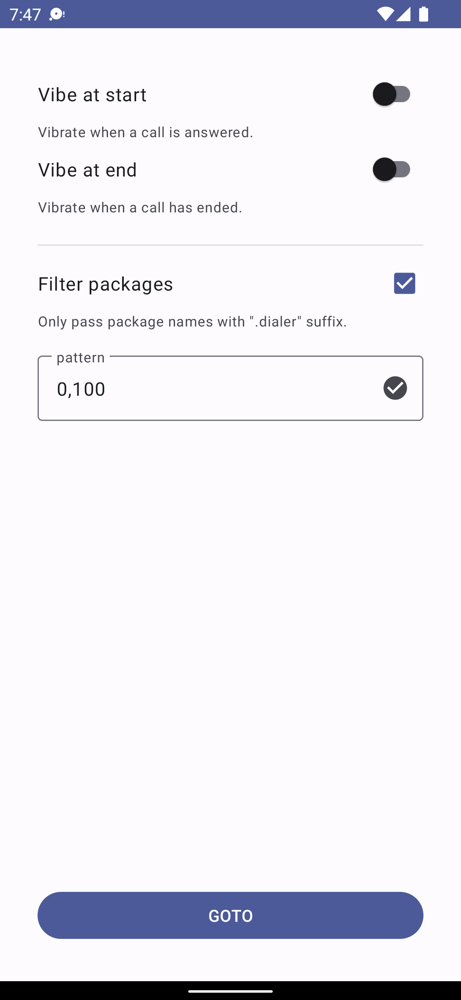

# Vibe

Vibrate on a call answer or end.

Tiny app to vibrate when a call is answered and/or has ended.

## Tested

* Phone (com.android.dialer)
* Google Phone (com.google.android.dialer)

## Permissions

* NOTIFICATION_LISTENER - scan for a call answer or end
* VIBRATE - notify when a call is answered or has ended

## Localization

## License

